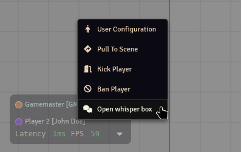

# WhisperBox

A small module for Foundry VTT that adds the ability to create a dedicated box for whispering to a specific player. The box includes a history of all whispers between you and that player.

## Usage

From the user context menu, you can open a whisper box to any player.

From the token context menu, you can open a whisper box to the owner of that token.

There's also a setting to launch whisper box automatically when you receive a whisper.

## Acknowledgements

Forked from Sk1mble's [WhisperBox](https://github.com/Sk1mble/WhisperBox)